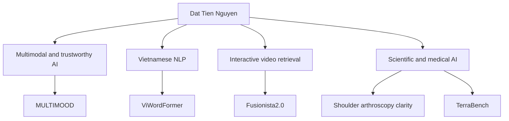

# Publication mind graph

```mermaid
graph TD
  D[Dat Tien Nguyen]
  D --> MM[Multimodal and trustworthy AI]
  D --> NLP[Vietnamese NLP]
  D --> VR[Interactive video retrieval]
  D --> SCI[Scientific and medical AI]
  MM --> MULTIMOOD[MULTIMOOD]
  NLP --> VIWORD[ViWordFormer]
  VR --> FUSIONISTA2[Fusionista2.0]
  SCI --> SHOULDER[Shoulder arthroscopy clarity]
  SCI --> TERRA[TerraBench]
```
